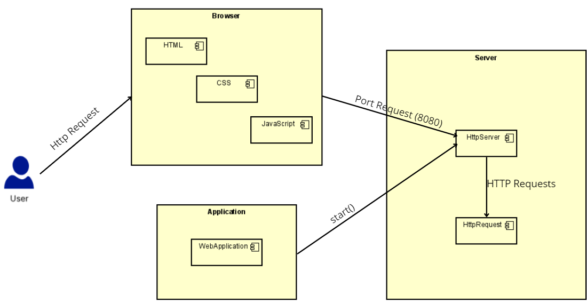
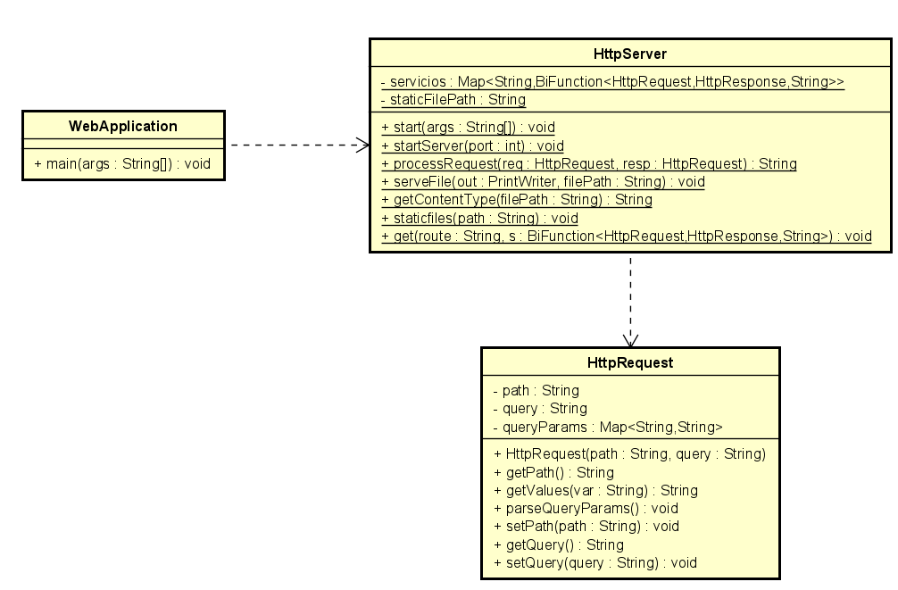
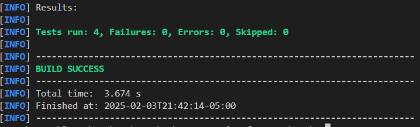

# Web Microframework

This project implements a lightweight web microframework that allows developers to define REST services dynamically using lambda functions. It enables handling HTTP requests, serving static files, and managing query parameters in a simple and efficient way.


## Getting Started

These instructions will get you a copy of the project up and running on your local machine for development and testing purposes.

### Prerequisites

You need to install the following tools to run the project:
1. Java
    ```
    java -version
    ```
    It should appear something like this:
    ```
    java version "17.0.10" 2024-01-16 LTS
    Java(TM) SE Runtime Environment (build 17.0.10+11-LTS-240)
    Java HotSpot(TM) 64-Bit Server VM (build 17.0.10+11-LTS-240, mixed mode, sharing)
    ```
2. Maven
    ```
    mvn -version
    ```
    It should appear something like this:
    ```
    Apache Maven 3.9.6 (bc0240f3c744dd6b6ec2920b3cd08dcc295161ae)
    Maven home: C:\workspace\apache-maven-3.9.6-bin\apache-maven-3.9.6
    Java version: 17.0.10, vendor: Oracle Corporation, runtime: C:\Program Files\Java\jdk-17
    Default locale: es_CO, platform encoding: Cp1252
    OS name: "windows 11", version: "10.0", arch: "amd64", family: "windows"
    ```
3. Git
    ```
    git --version
    ```
    It should appear something like this:
    ```
    git version 2.44.0
    ```

### Installing

1. Clone this repository and go to project directory:
    ```
    git clone https://github.com/oscar0617/Lab02-AREP-MicroframeworksWeb

    cd Lab02-AREP-MicroframeworksWeb
    ```
2. Build the project:
    ```
    mvn package
    ```
    Should appear something like this:
    ```
    [INFO] Building jar: Building jar: C:\Users\luzma\Desktop\AREP\Lab02-AREP-MicroframeworksWeb\target\Lab02-AREP-MicroframeworksWeb-1.0-SNAPSHOT.jar
    [INFO] ------------------------------------------------------------------------
    [INFO] BUILD SUCCESS
    [INFO] ------------------------------------------------------------------------
    ```
3. Run the project:
    ```
    java -cp target/Lab02-AREP-MicroframeworksWeb-1.0-SNAPSHOT.jar edu.escuelaing.arep.WebApplication
    ```
    Should appear something like this:
    ```
    Listo para recibir...
    ```
Now you are able to access into the ```index.html```. Using the following URL: ```http://localhost:8080```. If you want to try to serve the ```.js``` or any other file, you can do it with this URL: ```http://localhost:8080/fileToTry```, example: ```http://localhost:8080/script.js```

## Architecture



#### Overview

The following diagram illustrates the interaction between the components in the project:

### Components:

1. **User**:
   - Represents the end user who interacts with the system through a web browser by sending HTTP requests.

2. **Browser**:
   - Contains the front-end components of the application:
     - **HTML**: Defines the structure and content of the web page.
     - **CSS**: Provides styling for the web page.
     - **JavaScript**: Enables dynamic behavior and interaction with the server.

3. **Application**:
   - Contains the `WebApplication` class, which initializes the server and registers the endpoints. It serves as the main entry point for the backend.

4. **Server**:
   - Consists of the backend logic:
     - **HttpServer**: Manages the server's lifecycle, listens for HTTP requests on port 8080, and processes them.
     - **HttpRequest**: Parses incoming requests, extracting paths and query parameters for routing and handling.

### Interactions:

1. **HTTP Request**:
   - The user sends an HTTP request to the server via the browser (e.g., `GET` or `POST`).

2. **Port Request (8080)**:
   - The browser sends the request to the backend server running on port 8080, handled by the `HttpServer`.

3. **Server Logic**:
   - The `HttpServer` processes the incoming request, uses `HttpRequest` to extract relevant information, and invokes the appropriate logic based on the registered endpoints.

4. **Start Method**:
   - The `WebApplication` initializes the `HttpServer` and registers the endpoints to handle specific paths, such as `/app/hello` or `/app/pi`.

## Class Diagram


#### Overview
The following class diagram provides an overview of the core components and their relationships within the project:

### Classes:
1. **WebApplication**:
   - This is the entry point of the application.
   - It defines the static file location using `staticfiles()` and registers REST endpoints with the `get()` method.
   - The `main()` method initializes and starts the `HttpServer`.

2. **HttpServer**:
   - Responsible for managing the server's core functionality, including:
     - Storing registered REST endpoints (`servicios`) in a `Map`.
     - Handling HTTP requests through the `startServer()` method.
     - Routing requests to the appropriate handler using `processRequest()`.
     - Serving static files with `serveFile()` and determining MIME types with `getContentType()`.
   - Provides utility methods (`get()` and `staticfiles()`) for configuring the server and defining routes.

3. **HttpRequest**:
   - Represents an HTTP request.
   - Stores the request's path, query parameters, and parsed values in a `Map`.
   - Includes methods to retrieve the path (`getPath()`), query values (`getValues()`), and process query parameters (`parseQueryParams()`).

### Relationships:
- The `WebApplication` interacts with the `HttpServer` to define routes and start the server.
- The `HttpServer` utilizes the `HttpRequest` class to parse and handle incoming HTTP requests.

This structure ensures a clear separation of concerns, with `WebApplication` focused on configuration, `HttpServer` managing server logic, and `HttpRequest` handling request-specific details.


## Running the tests


The following unit tests were created to validate the functionality of the `HttpServer` class. These tests ensure that each component of the server behaves as expected.

### **1. `testHelloEndpoint`**
- **Purpose**: Validates that the `/app/hello` endpoint correctly returns a response containing the provided query parameter.
- **What it tests**:
  - When the request is sent with `name=John`, the response must contain `"John"`.

### **2. `testPiEndpoint`**
- **Purpose**: Ensures that the `/app/pi` endpoint correctly returns the value of Pi.
- **What it tests**:
  - The response must contain `"3.14"`.

### **3. `testEulerEndpoint`**
- **Purpose**: Validates that the `/app/euler` endpoint correctly returns the Euler number.
- **What it tests**:
  - The response must contain `"2.718"`.

### **4. `testGetContentTypeHtml`**
- **Purpose**: Ensures that the `getContentType` method returns the correct MIME type for `.html` files.
- **What it tests**:
  - Verifies that `getContentType("index.html")` returns `"text/html"`.




## Conclusion

This project successfully implemented a lightweight web framework capable of handling dynamic REST services and serving static files. Through the use of lambda functions, developers can define custom API endpoints efficiently, providing a simple yet powerful mechanism for handling HTTP requests.

Key achievements include:
- The ability to define RESTful endpoints dynamically using the `get()` method.
- A query extraction mechanism that allows endpoints to retrieve parameters from the request URL.
- A static file handler that serves HTML, CSS, JavaScript, and other assets from a predefined directory. In this case ```www```.
- A functional HTTP server that integrates with a microframework, capable of responding to various requests dynamically.


This implementation demonstrates how web applications can be structured efficiently while maintaining simplicity and performance.


## Built With

* [Maven](https://maven.apache.org/) - Dependency Management
* [GIT](https://git-scm.com) - Version control


## Versioning

I use [GitHub](http://git-scm.com) for versioning.

## Authors

* **Oscar Santiago Lesmes Parra** - [oscar0617](https://github.com/oscar0617)

Date: 03/02/2025
## License

This project is licensed under the GNU.

